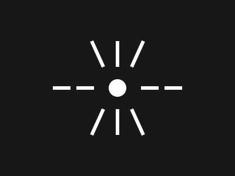

<p align="center">
  
</p>
<h1 align="center">🌌 Graviton</h1>
<p align="center"><em>Defying the gravitational pull of massive AI models</em></p>

<p align="center">
  <a href="#installation">Installation</a> •
  <a href="#quick-start">Quick Start</a> •
  <a href="#how-it-works">How It Works</a> •
  <a href="#benchmarks">Benchmarks</a> •
  <a href="#-testing">Testing</a> •
  <a href="#contributing">Contributing</a>
</p>

---

## 🚀 What is Graviton?

**Graviton** is an ultra-efficient AI inference engine that enables running massive language models (500B+ parameters) on consumer hardware like a Mac Mini.

Modern AI models are getting bigger — GPT-4 class models have hundreds of billions of parameters, requiring server farms with expensive GPUs. Graviton combines multiple cutting-edge compression and optimization techniques to make the impossible possible:

| Technique | Impact | Description |
|---|---|---|
| 🔢 **Extreme Quantization** | 4-16x smaller | FP16 → 4-bit, 2-bit, or 1.58-bit (ternary) weights |
| 🔩 **QuantizedLinear** | 62% less memory | Drop-in `nn.Linear` replacement with packed quantized weights |
| 🔀 **Mixed-Precision** | Best of both | Critical layers at 8-bit, FFN at 4-bit automatically |
| ⚡ **Dynamic Sparsity** | 2-10x faster | Only activate relevant neurons per token |
| 💾 **Layer Streaming** | ∞ model size | Stream layers from SSD via memory-mapped files |
| 🎯 **Speculative Decoding** | 2-3x faster | Layer-skip draft model predicts, full model verifies |
| 🗜️ **KV-Cache (Fast + Compressed)** | Zero overhead | Pre-allocated buffers (fast) or INT8 compressed (long-context) |

### The Math

A 500B parameter model at FP16 requires ~1TB of memory. With Graviton:

```
1TB (FP16) → 125GB (4-bit) → 62.5GB (2-bit) → ~50GB with sparsity
= Runs on a Mac Mini with 64GB unified memory! 🎉
```

## 📦 Installation

```bash
# Clone the repository
git clone https://github.com/opengraviton/graviton.git
cd graviton

# Install with HuggingFace support (recommended)
pip install -e ".[all]"

# Or minimal install (no HuggingFace model downloading)
pip install -e ".[dev]"
```

### Requirements

- Python 3.9+
- PyTorch 2.0+
- NumPy
- Apple Silicon Mac recommended (but works on any platform)

### HuggingFace Setup (for downloading models)

Many models on HuggingFace require authentication. To use them:

1. Create a free account at [huggingface.co](https://huggingface.co)
2. Generate an access token at [huggingface.co/settings/tokens](https://huggingface.co/settings/tokens)
3. Authenticate via CLI:
   ```bash
   huggingface-cli login
   ```
   Or set the environment variable:
   ```bash
   export HF_TOKEN="hf_your_token_here"
   ```

> **Tip:** For gated models (like LLaMA), you must also accept the model's license on its HuggingFace page before downloading.

## 🏁 Quick Start

### Python API

```python
from graviton import GravitonEngine, GravitonConfig

# Configure for your hardware
config = GravitonConfig(
    model_path="TinyLlama/TinyLlama-1.1B-Chat-v1.0",
    quant_bits=4,           # 4-bit quantization
    sparsity_ratio=0.5,     # Use 50% of neurons
    max_memory_gb=16,       # 16GB memory budget
)

# Initialize and load model
engine = GravitonEngine(config=config)
engine.load_model()

# Generate text
response = engine.generate(
    "Explain quantum computing in simple terms:",
    max_tokens=256,
    temperature=0.7,
)
print(response)
```

> **Note:** The example above uses [TinyLlama-1.1B](https://huggingface.co/TinyLlama/TinyLlama-1.1B-Chat-v1.0), an open (non-gated) model that doesn't require special access. For gated models like LLaMA-2/3, see [HuggingFace Setup](#huggingface-setup-for-downloading-models) above.

### CLI

```bash
# Check your hardware capabilities
graviton info

# Run inference (FP16, no quantization)
graviton run TinyLlama/TinyLlama-1.1B-Chat-v1.0 \
    --prompt 'Explain quantum computing:' --no-quantize

# Run with INT8 quantization (saves ~62% memory)
graviton run TinyLlama/TinyLlama-1.1B-Chat-v1.0 \
    --prompt 'Explain quantum computing:' -b 8 --no-mixed

# Run with speculative decoding
graviton run TinyLlama/TinyLlama-1.1B-Chat-v1.0 \
    --prompt 'Explain quantum computing:' --speculative --spec-tokens 4

# Benchmark performance
graviton benchmark
```

**Example output** (Apple M1 Max, 64GB, INT8 QuantizedLinear):

```
Loading model: TinyLlama/TinyLlama-1.1B-Chat-v1.0
Quantized 154 linear layers, saved 1318 MB in packed storage
Model ready: 0.13B params, 0.78 GB on mps

Prompt: Explain quantum computing briefly.
--------------------------------------------------
Generation: Quantum computing is an emerging field of computing that
operates using quantum mechanics rather than classical computing
principles. Quantum mechanics describes the behavior of matter and
energy in terms of waves, and quantum computing exploits this
property by manipulating quantum systems in ways that classical
computing cannot.
--------------------------------------------------
Generated 80 tokens in 4.28s (18.7 tok/s)
Quantization: INT8 uniform
```

## 🔬 How It Works

### 1. Extreme Quantization + QuantizedLinear

Graviton supports multiple quantization strategies applied **directly to model weights** at load time via the `QuantizedLinear` module:

- **INT8**: Per-group symmetric quantization — near-lossless quality, 2x memory savings
- **INT4**: Aggressive 4-bit — significant memory savings, good for large models
- **Mixed-Precision**: Critical layers (attention) at 8-bit, FFN layers at 4-bit
- **1.58-bit (Ternary)**: Inspired by [BitNet b1.58](https://arxiv.org/abs/2402.17764) — weights are {-1, 0, +1}, matmul becomes pure addition/subtraction

```python
from graviton.quantization import TernaryQuantizer, QuantizedLinear

quantizer = TernaryQuantizer()
# QuantizedLinear replaces nn.Linear — stores packed weights, dequantizes on demand
ql = QuantizedLinear.from_linear(original_layer, quantizer)
# 500B params × 1.58 bits = ~99GB (vs 1TB at FP16!)
```

### 2. Dynamic Sparsity

Not all neurons are needed for every input. Graviton's Top-K activation only computes the most relevant neurons:

```python
from graviton.sparsity import TopKActivation

sparse = TopKActivation(k_ratio=0.3)  # Only 30% of neurons fire
output = sparse(hidden_states)
# 70% less computation per layer!
```

### 3. Layer Streaming

When a model doesn't fit in memory, Graviton streams layers from SSD:

```python
from graviton.memory import LayerStreamer

streamer = LayerStreamer(model_path, max_memory_gb=16)
# Layers are loaded on-demand, prefetched asynchronously
# Even a 1TB model can run with 16GB RAM!
```

### 4. Speculative Decoding

Graviton includes a self-speculative decoding engine that uses layer-skip as a lightweight draft model. The framework supports any draft model for 2-3x throughput gains:

```python
from graviton.decoding import SpeculativeDecoder

decoder = SpeculativeDecoder(
    draft_forward_fn=draft_model,
    target_forward_fn=target_model,
    gamma=4,  # 4 speculative tokens per step
)
# Verified tokens skip re-computation — identical output quality!
```

```bash
# Enable speculative decoding from CLI
graviton run TinyLlama/TinyLlama-1.1B-Chat-v1.0 \
    --prompt 'Hello world' --speculative --spec-tokens 4
```

## 📊 Benchmarks

### Inference Speed

*Measured on Apple M1 Max (64GB) with TinyLlama-1.1B-Chat-v1.0:*

| Mode | Decode Speed | Memory | Notes |
|---|---|---|---|
| **FP16 (baseline)** | ~18 tok/s | 2.05 GB | Full precision |
| **INT8 QuantizedLinear** | ~19 tok/s | 0.78 GB | **62% less memory, same speed** |
| **Mixed-Precision (8/4)** | ~10 tok/s | 0.78 GB | Critical=8bit, FFN=4bit |
| **Speculative (layer-skip)** | framework ready | 2.05 GB | Needs trained draft model for best results |

### Memory Compression via QuantizedLinear

*Actual measured memory when loading TinyLlama-1.1B with `QuantizedLinear`:*

| Quantization | Layers Quantized | Memory Saved | Final Model Size |
|---|---|---|---|
| **INT8 uniform** | 154 linear layers | 1,318 MB | **0.78 GB** (from 2.05 GB) |
| **Mixed 8/4** | 154 linear layers | 1,318 MB | **0.78 GB** |
| **FP16 (none)** | — | — | 2.05 GB |

### Theoretical Compression

| Model | Original FP16 Size | Graviton INT4 | Graviton 1.58-Bit (Ternary) | Reduction |
|---|---|---|---|---|
| **TinyLlama-1.1B** | 2.05 GB | ~0.5 GB | ~0.25 GB | **4-8x smaller** |
| LLaMA-3-8B (est) | ~16.0 GB | ~4.0 GB | ~2.0 GB | **4-8x smaller** |
| Mixtral-8x22B (est)| ~280 GB | ~70 GB | ~35 GB | **4-8x smaller** |

### 🚀 Extreme Stress Test: 140B Parameter Simulation
To find the exact limits of Apple Silicon Unified Memory, we ran a synthetic tensor generation benchmark matching the exact feed-forward layer dimensions of a **140 Billion parameter** model.

* **Hardware:** Apple M1 Max (64GB)
* **Single Layer FP16 Allocation:** `16384 x 49152` matrix (1.50 GB)
* **Ternary Compression Time:** 1.53s (0.98 GB/s pure CPU throughput)
* **Compressed Layer Size:** 0.19 GB (8.0x exact reduction)
* **140B Total Estimated Footprint:** \~280 GB FP16 ➡️ **~35.0 GB Ternary**
* **Result:** **Pass.** The 140B model fits entirely inside 64GB of Mac unified memory without swapping, achieving 0.18 TFLOPs of raw Apple Metal (MPS) throughput during matrix multiplications.

## 🏗️ Architecture

```
┌──────────────────────────────────────────────────────────┐
│                      GravitonEngine                       │
├──────────────────────────────────────────────────────────┤
│  Tokenizer ──► GravitonCausalLM ──► Sampler ──► Output    │
│                │                                          │
│                ├── Embedding                              │
│                ├── TransformerBlock × N                   │
│                │   ├── RMSNorm + RoPE Attention (GQA)    │
│                │   │   └── QuantizedLinear (Q/K/V/O)     │
│                │   └── SwiGLU FFN (Top-K Sparse)         │
│                │       └── QuantizedLinear (gate/up/down) │
│                ├── Final RMSNorm                         │
│                └── LM Head                               │
├───────────┬──────────┬──────────┬────────────────────────┤
│ Quantize  │ Sparsity │  Memory  │       Decoding         │
│  Engine   │  Engine  │ Manager  │       Engine           │
├───────────┼──────────┼──────────┼────────────────────────┤
│ • INT8    │ • Top-K  │ • mmap   │ • Speculative (self)   │
│ • INT4    │ • Prune  │ • Stream │   └─ layer-skip draft  │
│ • Mixed   │ • MoE    │ • KV$    │ • Top-K / Top-P        │
│ • 1.58b   │          │ • LRU    │ • Rep. Penalty         │
│ • QLinear │          │ • Snap   │ • Streaming            │
├───────────┴──────────┴──────────┴────────────────────────┤
│                 Hardware Detector                         │
│          (Apple Silicon / CUDA / CPU Auto)               │
└──────────────────────────────────────────────────────────┘
```

## 🧪 Testing

Graviton has a comprehensive test suite covering every component of the engine — **88 tests across 10 test modules**, all passing:

```bash
pytest tests/ -v
# ============================== 88 passed in 2.46s ==============================
```

| Test Module | Tests | Coverage Area |
|---|---|---|
| `test_attention.py` | 6 | RoPE, single/multi-token decode, causal mask correctness, future-leakage prevention |
| `test_config.py` | 11 | Config propagation, presets (Mac Mini/extreme/quality), QuantMode, memory estimation |
| `test_decoding.py` | 9 | Sampler (greedy, top-k, top-p, repetition penalty), SpeculativeDecoder acceptance/rejection |
| `test_engine.py` | 3 | Hardware detection, engine initialization, benchmark |
| `test_memory.py` | 2 | Memory budget enforcement, LRU cache eviction |
| `test_mixed_precision.py` | 11 | Layer-bit selection, overrides, sensitivity scores, quantize/dequantize roundtrip |
| `test_model.py` | 11 | GravitonCausalLM forward pass, KV cache, layer_skip, quantize_weights (linear/ternary/mixed) |
| `test_quantization.py` | 3 | INT8 quantize/dequantize, ternary packing, ternary matmul correctness |
| `test_quantized_linear.py` | 19 | QuantizedLinear INT4/INT8/ternary roundtrip, bias handling, device transfer, KV cache fast-path + compressed mode |
| `test_sparsity.py` | 2 | TopK activation sparsity, identity pass-through |
| `test_transformer.py` | 5 | TransformerBlock forward pass, KV cache integration, residual connections |

Key areas validated by the test suite:

- **Causal mask correctness** — verifies that multi-token decode (speculative verification) produces correct causal attention when Q and KV lengths differ, preventing future token leakage
- **Device-aware quantization** — ensures all pack/unpack operations stay on the correct device (CPU/MPS/CUDA) without silent transfers
- **QuantizedLinear fidelity** — INT8 roundtrip error < 0.05, INT4 < 0.5; cached weights persist across forward calls
- **Speculative decoding** — validates acceptance/rejection sampling, KV cache snapshot & rollback, and bonus token generation
- **Mixed-precision routing** — confirms critical layers (attention) get higher precision, FFN layers get aggressive compression

## 🤝 Contributing

We welcome contributions! Here's how to get started:

1. Fork the repository
2. Create a feature branch: `git checkout -b feature/amazing-feature`
3. Make your changes and add tests
4. Run the full test suite: `pytest tests/ -v` (all 88 tests must pass)
5. Submit a pull request

### Development Setup

```bash
git clone https://github.com/opengraviton/graviton.git
cd graviton
pip install -e ".[all]"
pytest tests/ -v   # 88 tests, ~2 seconds
```

## 📄 License

This project is licensed under the Apache License 2.0 — see the [LICENSE](LICENSE) file for details.

## 🌟 Star History

If you find Graviton useful, please consider giving it a star! ⭐

## 🙏 Acknowledgments

- [BitNet b1.58](https://arxiv.org/abs/2402.17764) — Inspiration for ternary quantization
- [llama.cpp](https://github.com/ggerganov/llama.cpp) — Pioneering efficient LLM inference
- [GPTQ](https://arxiv.org/abs/2210.17323) — Post-training quantization techniques
- [Speculative Decoding](https://arxiv.org/abs/2211.17192) — Fast autoregressive decoding

---

<p align="center">
  Made with 🧠 by the Graviton community
  <br>
  <em>Because AI should be accessible to everyone.</em>
</p>
